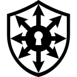
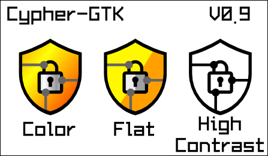
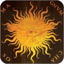
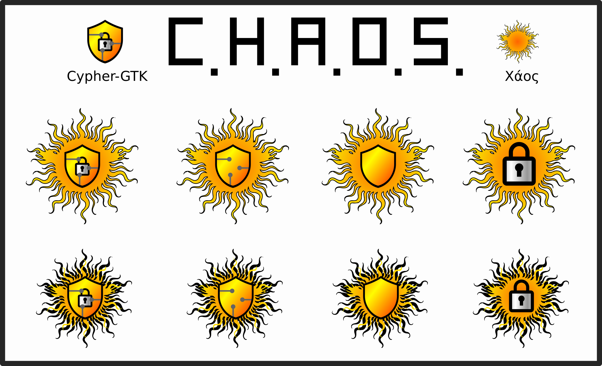
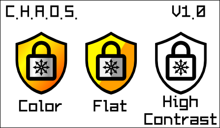
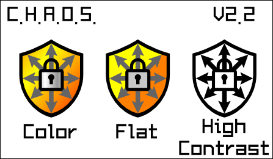
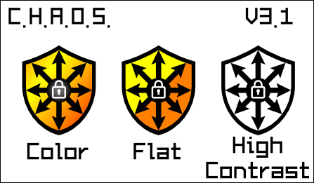
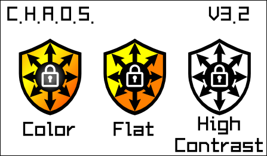
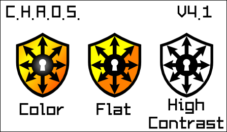

C.H.A.O.S. ~ Logo Study
=======================
### Chaos is the lock. The key is yours.

## Presentation

|Type|128x128|64x64|32x32|24x24|16x16|
|:---:|:---:|:---:|:---:|:---:|:---:|
|Color||||||
|Flat||||||
|High Contrast||||||

## The History

Brainstorm [here](https://bubs.altervista.org/index.php?topic=1275.msg248393#msg248393).

The first logo summarizes the concept of security (shield) and protection (padlock).

---

The next logo will sum up the concept of the chaos that hides our things.

This is the iconography of Chaos ([see wikipedia](https://en.wikipedia.org/wiki/Chaos_(cosmogony)))

I stylized the chaos logo and these are some tests

The goal is to create a logo:
* Unique
* Recognizable
* Easy to read
* Impactful
* Clean (i.e., recognizable even in small sizes)

The representation of chaos is rather chaotic, not usable as a 16x16 icon.

---

GrEyOwL [suggests](https://bubs.altervista.org/index.php?msg=248411) using the symbol representing chaos.

So I sketched these out.

 
The chaos symbol is too small

 
Arrows touch the edge of the shield. Chaos stops there. The chaos is controlled. 
The lock has been shrunk. 
The high-contrast version is chaotic.

---

Sgnablo and Buntolo [suggest](https://bubs.altervista.org/index.php?msg=248493) giving more visibility to the symbol rather than the padlock.

 
The colors remain as such, however the new arrangement in the design accentuates the contrast. 
The padlock is too small.

 
The padlock is visible even at low resolutions. 
The center of the logo has too many elements.

 
The padlock has been replaced with a lock. The center of the logo is simpler. 
The black circle has been made smaller. The body of the logo looks more open.

|Feature      | V 1.0  | V 2.2  | V 3.1  | V 3.2  | V 4.1  |
|:------------|:------:|:------:|:------:|:------:|:------:|
|Unique       |        |&#10003;|&#10003;|&#10003;|&#10003;|
|Recognizable |&#10003;|&#10003;|&#10003;|&#10003;|&#10003;|
|Easy to read |&#10003;|        |        |&#10003;|&#10003;|
|Impactful    |        |&#10003;|&#10003;|&#10003;|&#10003;|
|Clean        |        |        |        |        |&#10003;|